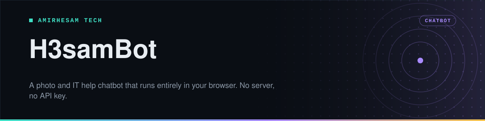

<p align="center">
  
</p>

<p align="center">
  
  
  
  
  
  <a href="https://github.com/amirh3sam/H3samBot/stargazers"></a>
</p>

<p align="center">
  <a href="#quick-start"><b>Quick start</b></a> ·
  <a href="#how-it-finds-an-answer">How it works</a> ·
  <a href="#teaching-it-something-new">Teach it</a> ·
  <a href="#the-automatic-updates">Auto updates</a> ·
  <a href="#faq">FAQ</a>
</p>

Most chatbots need a server, an account and an API key that costs money per question. This one needs a browser.

H3samBot answers questions about **photography and IT support** out of a knowledge base stored as a single JSON file. The matching happens in JavaScript on the page you are looking at. Nothing is sent anywhere, nothing is billed, and the whole thing works offline once loaded.

- **Open `index.html` and it runs.** No build step, no `npm install`, no backend.
- **No API key and no cost**, because there is no model call. It is retrieval, not generation.
- **A knowledge base that refreshes itself** every six hours from photography and tech news feeds.
- **Private by design.** Your questions never leave the browser.

## Quick start

Download or clone the repository and open `index.html`:

```bash
git clone https://github.com/amirh3sam/H3samBot.git
cd H3samBot
```

Then double-click `index.html`. That is the whole setup.

Ask it something like:

```
best shutter for sports
fix high CPU on Windows
```

<details>
<summary><b>Publishing it to GitHub Pages</b></summary>

Because it is static, any file host will serve it.

1. Push the files to a repository.
2. Open **Settings → Pages**.
3. Set **Source** to *Deploy from a branch*, pick `main` and the `/` (root) folder.

It goes live at `https://<your-username>.github.io/H3samBot/`.

</details>

> [!TIP]
> The page shows a **Status** line under the chat. If something is wrong, it says so there, and the same message goes to the browser console.

## How it finds an answer

There is no language model involved. The bot uses **TF-IDF with cosine similarity**, a classic information retrieval method, and it is worth understanding because it explains both the strengths and the limits.

1. **Every entry becomes a bag of words.** Each knowledge base entry is split into terms.
2. **Rare words count for more.** That is the IDF part. A word like "the" appears everywhere and carries no signal, so it is weighted down. A word like "aperture" narrows things sharply, so it is weighted up.
3. **Your question becomes a vector too**, scored the same way.
4. **The closest entry wins**, measured by the angle between the two vectors.

The practical consequence: it is very good when your question shares vocabulary with an entry, and it has nothing to say when it does not. It cannot reason, and it will not invent an answer, which also means it will not make one up.

| File | Job |
|---|---|
| [`index.html`](index.html) | The page and the chat layout |
| [`bot.js`](bot.js) | Scoring, matching and rendering the replies |
| [`style.css`](style.css) | The look |
| [`data/knowledge.json`](data/knowledge.json) | Everything the bot knows |
| [`scripts/fetch.js`](scripts/fetch.js) | Rebuilds the knowledge base from RSS feeds |

## Teaching it something new

Everything the bot knows lives in [`data/knowledge.json`](data/knowledge.json). Add an object to the array and reload the page.

```json
{
  "title": "Shutter speed for sports",
  "q": "sports shutter speed freeze motion fast action blurry football",
  "a": "Start at <b>1/1000s</b> and raise it if motion still blurs. Open the aperture and raise ISO to keep the exposure."
}
```

| Field | What it is for |
|---|---|
| `title` | A short heading, shown with the answer |
| `q` | The words someone might use when asking. This is what gets matched, so write generously |
| `a` | The answer. HTML is allowed, so `<b>`, `<br>` and links all work |

> [!IMPORTANT]
> `q` is the field that decides whether your entry is ever found. Put the synonyms in: if the entry is about a blurry photo, include *blurry*, *soft*, *shake*, *motion* and *sharp*. Entries are missed far more often for thin keywords than for bad answers.

## The automatic updates

A GitHub Action in [`.github/workflows/update-kb.yml`](.github/workflows/update-kb.yml) runs [`scripts/fetch.js`](scripts/fetch.js) every six hours. It reads sixteen RSS feeds, sorts each item into the photography or IT bucket by keyword, and commits the rebuilt `knowledge.json` back to the repository.

- **Photography:** PetaPixel, DPReview, Fstoppers, Digital Camera World, SLR Lounge, ISO 1200, Photofocus
- **IT and tech:** The Verge, TechRadar, CNET, Tom's Hardware, ZDNet, Windows Central, BleepingComputer, How-To Geek, XDA Developers

You can run the refresh yourself:

```bash
npm install
npm run update:kb
```

Or trigger the workflow by hand from the **Actions** tab, which is what **workflow_dispatch** in the file enables.

## FAQ

<details>
<summary><b>It says it does not know, and I am sure the answer is in there</b></summary>

Your wording and the entry's `q` field share too few words. Add the words you actually used to that entry's `q` and reload.

</details>

<details>
<summary><b>Can I point it at a real language model later?</b></summary>

Yes, and the design anticipates it. Keep the retrieval exactly as it is, then send the best-matching entries to an API as context along with the question. That is retrieval-augmented generation, and the retrieval half already works. The call would go in [`bot.js`](bot.js).

</details>

<details>
<summary><b>Does it work offline?</b></summary>

Once the page and `knowledge.json` have loaded, yes. Nothing else is fetched while you chat.

</details>

<details>
<summary><b>Can I use my own knowledge base?</b></summary>

Replace `data/knowledge.json` with your own entries in the same shape. Nothing in the matching code is specific to photography or IT.

</details>

<details>
<summary><b>Is HTML in answers safe?</b></summary>

Answers are inserted as HTML so you can format them, which means anything in the `a` field is trusted. Keep the knowledge base under your own control and do not paste in entries from sources you do not trust.

</details>

## About

Made by **[AmirHesam Tech](https://amirhesamtech.com)**. More tech content on TikTok: [@techwithamirh3sam](https://www.tiktok.com/@techwithamirh3sam).

If this repo saved you some time, please give it a star. It helps other people find it.
